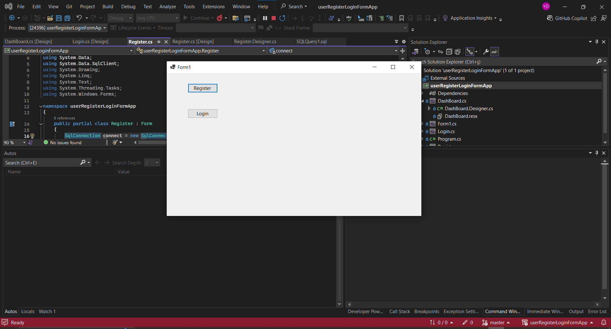
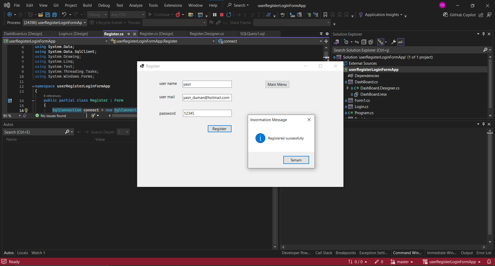
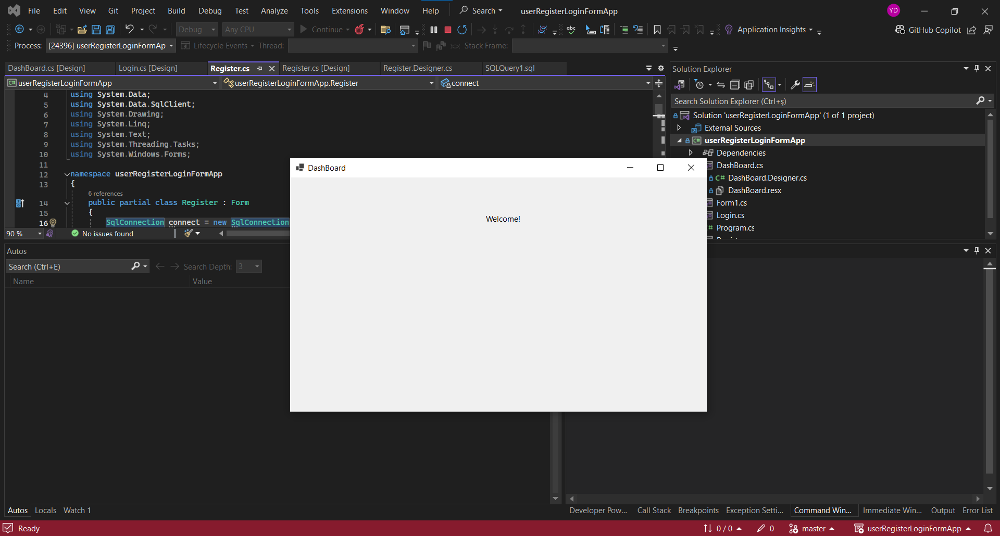

# Simple User Register/Login Form App

During the internship, in order to get used to the C# syntax and Visual Studio IDE, I developed a simple form application that allows users to register and login.

# main

# register

# login 

# welcome

